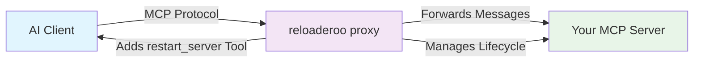
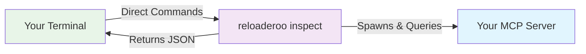

[](https://badge.fury.io/js/reloaderoo)
[](https://opensource.org/licenses/MIT)
[](https://nodejs.org/)
[](https://pkg.pr.new/~/OWNER/REPO)

> **Test and hot-reload MCP servers with CLI inspection tools and transparent proxy capabilities**

**A dual-mode MCP development tool** that operates as both a CLI inspection tool and a transparent proxy server for the Model Context Protocol (MCP). Works excellently with VSCode MCP, well with Claude Code, and supports other MCP-enabled clients.

## 🔄 Two Modes, One Tool

**reloaderoo** provides two distinct operational modes to fit different development workflows:

### 🔍 **CLI Mode** (Inspection & Testing)
Direct command-line access to MCP servers without client setup:
- ✅ **One-shot commands** - Test tools, list resources, get server info
- ✅ **No MCP client required** - Perfect for testing and debugging
- ✅ **Raw JSON output** - Ideal for scripts and automation
- ✅ **8 inspection commands** - Complete MCP protocol coverage

### 🔄 **Proxy Mode** (Hot-Reload Development)  
Transparent proxy server that enables seamless hot-reloading:
- ✅ **Hot-reload MCP servers** without disconnecting your AI client
- ✅ **Session persistence** - Keep your development context intact
- ✅ **Automatic `restart_server` tool** - AI agents can restart servers on demand
- ✅ **Transparent forwarding** - Full MCP protocol passthrough

## 🎯 Why reloaderoo?

When developing MCP servers, you typically face two problems:
1. **Testing requires complex MCP client setup** → CLI mode solves this
2. **Code changes require restarting your entire AI session** → Proxy mode solves this

Both modes work together to create a seamless MCP development experience.

## 🚀 Quick Start

### Installation

```bash
# Install globally for easy access
npm install -g reloaderoo

# Or use with npx (no installation required)
npx reloaderoo --help
```

### Choose Your Mode

#### 🔍 **CLI Mode** - Testing & Debugging
Perfect for testing MCP servers without client setup:

```bash
# List all tools in your server
reloaderoo inspect list-tools -- node my-mcp-server.js

# Call a specific tool
reloaderoo inspect call-tool echo --params '{"message":"hello"}' -- node my-mcp-server.js

# Get server information
reloaderoo inspect server-info -- node my-mcp-server.js
```

#### 🔄 **Proxy Mode** - Hot-Reload Development
For AI client integration with hot-reload capabilities:

```bash
# Start proxy server (your AI client connects to this)
reloaderoo proxy -- node my-mcp-server.js

# With debug logging
reloaderoo proxy --log-level debug -- node my-mcp-server.js
```

Then configure your AI client to connect to reloaderoo instead of directly to your server.

### 🎯 **Recommended Clients**

**Best Experience**: **VSCode** & **Cursor** - Full protocol support with automatic capability detection  
**Good Experience**: **Claude Code** & **Windsurf** - Works well, may need manual refresh for new tools  

## 🛠️ Development Workflow

### 🔍 **CLI Mode Workflow** (Testing & Debugging)

Perfect for testing individual tools or debugging server issues:

```bash
# 1. Test your server quickly
reloaderoo inspect list-tools -- node my-mcp-server.js

# 2. Call specific tools to verify behavior
reloaderoo inspect call-tool my_tool --params '{"param":"value"}' -- node my-mcp-server.js

# 3. Check server health
reloaderoo inspect ping -- node my-mcp-server.js
```

### 🔄 **Proxy Mode Workflow** (Hot-Reload Development)

For full development sessions with AI clients:

#### 1. **Start Development Session**
Configure your AI client to connect to reloaderoo proxy instead of your server directly:
```bash
reloaderoo proxy -- node my-mcp-server.js
# or with debug logging:
reloaderoo proxy --log-level debug -- node my-mcp-server.js
```

#### 2. **Develop Your MCP Server**
Work on your server code as usual:
```javascript
// my-mcp-server.js
export const server = new Server({
  name: "my-awesome-server",
  version: "1.0.0"
});

// Add new tools, modify existing ones, etc.
server.addTool("new_feature", /* ... */);
```

#### 3. **Test Changes Instantly**
Ask your AI agent to restart the server:
```
"Please restart the MCP server to load my changes"
```

The agent will call the `restart_server` tool automatically. Your new capabilities are immediately available!

#### 4. **Continue Development**
Your AI session continues with the updated server capabilities. No connection loss, no context reset.

## 📋 Command Line Interface

reloaderoo provides two primary modes of operation:

```bash
reloaderoo [options] [command]

Global Options:
  -V, --version                    Output the version number
  -h, --help                       Display help for command

Commands:
  proxy [options] -- <command>    🔄 Run as MCP proxy server (hot-reload mode)
  inspect [subcommand]             🔍 Inspect and debug MCP servers (CLI mode)
  info [options]                   📊 Display version and configuration information
  help [command]                   ❓ Display help for command
```

### 🔄 **Proxy Mode Commands** (Hot-Reload Development)

```bash
reloaderoo proxy [options] -- <child-command> [child-args...]

Options:
  -w, --working-dir <directory>    Working directory for the child process
  -l, --log-level <level>          Log level (debug, info, notice, warning, error, critical)
  -f, --log-file <path>            Custom log file path (logs to stderr by default)
  -t, --restart-timeout <ms>      Timeout for restart operations (default: 30000ms)
  -m, --max-restarts <number>     Maximum restart attempts 0-10 (default: 3)
  -d, --restart-delay <ms>        Delay between restart attempts (default: 1000ms)
  -q, --quiet                     Suppress non-essential output
  --no-auto-restart               Disable automatic restart on crashes
  --debug                         Enable debug mode with verbose logging
  --dry-run                       Validate configuration without starting proxy

Examples:
  reloaderoo proxy -- node server.js
  reloaderoo -- node server.js                    # Same as above (proxy is default)
  reloaderoo proxy --log-level debug -- python mcp_server.py --port 8080
```

### 🔍 **CLI Mode Commands** (Inspection & Testing)

```bash
reloaderoo inspect [subcommand] [options] -- <child-command> [child-args...]

Subcommands:
  server-info [options]            Get server information and capabilities
  list-tools [options]             List all available tools
  call-tool [options] <name>       Call a specific tool
  list-resources [options]         List all available resources
  read-resource [options] <uri>    Read a specific resource
  list-prompts [options]           List all available prompts
  get-prompt [options] <name>      Get a specific prompt
  ping [options]                   Check server connectivity
  mcp [options]                    Start MCP inspection server (exposes debug tools as MCP server)

Common Options (available for all subcommands):
  -w, --working-dir <dir>          Working directory for the child process
  -t, --timeout <ms>               Operation timeout in milliseconds (default: 30000)
  -q, --quiet                      Suppress child process stderr output (get clean JSON)

Examples:
  reloaderoo inspect list-tools -- node server.js
  reloaderoo inspect call-tool get_weather --params '{"location": "London"}' -- node server.js
  reloaderoo inspect server-info -- node server.js
  reloaderoo inspect mcp -- node server.js        # Start MCP inspection server
  
  # Get clean JSON output without server logs
  reloaderoo inspect list-tools --quiet -- node server.js
  reloaderoo inspect call-tool echo --quiet --params '{"message":"test"}' -- node server.js
```

### **Info Command (Diagnostics)**

```bash
reloaderoo info [options]

Options:
  --verbose                        Show detailed system information
  
Examples:
  reloaderoo info                  # Show basic system information
  reloaderoo info --verbose        # Show detailed diagnostics
```

## 🔍 CLI Mode Deep Dive (Inspection & Testing)

CLI mode provides direct command-line access to MCP servers without requiring client setup - perfect for testing and debugging.

### 🤖 **AI Agent Use Case** - The Primary Design Goal

**CLI mode is specifically designed for AI agents** (like Claude Code, Cursor, etc.) that have terminal access but don't have MCP server configuration capabilities. This solves a critical development workflow problem:

**The Problem:** When an AI agent is helping you develop an MCP server, it needs to test changes, but:
- ❌ The agent can't configure itself to use your MCP server directly
- ❌ Asking users to manually configure MCP clients breaks the development flow
- ❌ Using resource tools or web fetching is indirect and limited

**The Solution:** CLI mode gives AI agents direct, terminal-based access to your MCP server:
- ✅ **No Client Configuration**: Agent uses terminal commands, not MCP client setup
- ✅ **Stateless & Reliable**: Each command runs independently - no persistent connections to fail
- ✅ **Raw Protocol Access**: Agent sees exact MCP inputs/outputs for transparent debugging
- ✅ **Immediate Testing**: Agent can validate changes instantly without user intervention

### 🔧 **Technical Benefits**

**Stateless Execution:**
- Each CLI command spawns the server, executes the request, and terminates
- Perfect reliability - no persistent state to get corrupted
- No connection management or session handling complexity

**⚠️ Important Limitation:**
- Servers with in-memory state machines won't work properly in CLI mode
- Each command is isolated - no shared state between calls
- For stateful servers, use Proxy mode instead

**Transparent Debugging:**
- Raw JSON output shows exact MCP protocol requests/responses
- No proxy layer or client interpretation
- Perfect for understanding what's actually happening at the protocol level
- Use `--quiet` flag to suppress server logs and get clean JSON for scripting

### 📝 **Direct CLI Commands** (One-shot execution)
Execute single commands and get immediate results:

```bash
# List all tools in your server
reloaderoo inspect list-tools -- node my-server.js

# Call a specific tool
reloaderoo inspect call-tool echo --params '{"message":"hello"}' -- node my-server.js

# Get server information
reloaderoo inspect server-info -- node my-server.js

# Check server connectivity
reloaderoo inspect ping -- node my-server.js

# Get clean JSON output without server logs (perfect for scripting)
reloaderoo inspect list-tools --quiet -- node my-server.js
reloaderoo inspect call-tool echo --quiet --params '{"message":"hello"}' -- node my-server.js
```

### 🔧 **MCP Inspection Server** (Persistent CLI mode for MCP clients)
Start CLI mode as a persistent MCP server for interactive debugging:

```bash
# Start reloaderoo in CLI mode as an MCP server
reloaderoo inspect mcp -- node my-server.js
```

This runs CLI mode as a persistent MCP server, exposing 8 debug tools through the MCP protocol:
- `list_tools` - List all server tools
- `call_tool` - Call any server tool
- `list_resources` - List all server resources
- `read_resource` - Read any server resource
- `list_prompts` - List all server prompts
- `get_prompt` - Get any server prompt  
- `get_server_info` - Get comprehensive server info
- `ping` - Test server connectivity

## 🏗️ How Both Modes Work

### 🔄 **Proxy Mode Architecture** (Hot-Reload Development)



**Proxy Mode Magic:**
1. **Transparent Forwarding** - All MCP messages pass through seamlessly
2. **Capability Augmentation** - Adds `restart_server` tool to your server's capabilities  
3. **Process Management** - Spawns, monitors, and restarts your server process
4. **Session Persistence** - Client connection remains active during server restarts
5. **Protocol Compliance** - Full MCP v2025-03-26 support with intelligent fallbacks

### 🔍 **CLI Mode Architecture** (Direct Testing)



**CLI Mode Magic:**
1. **Direct Execution** - No proxy layer, direct command execution
2. **One-Shot Queries** - Each command spawns server, executes, and returns results
3. **Raw JSON Output** - Perfect for automation and scripting
4. **No Client Setup** - Test MCP servers without configuring MCP clients
5. **8 Inspection Commands** - Complete MCP protocol coverage for testing

## 🔧 Configuration

### Environment Variables

Configure reloaderoo behavior via environment variables:

```bash
# Logging Configuration
export MCPDEV_PROXY_LOG_LEVEL=debug           # Log level (debug, info, notice, warning, error, critical)
export MCPDEV_PROXY_LOG_FILE=/path/to/log     # Custom log file path (default: stderr)
export MCPDEV_PROXY_DEBUG_MODE=true           # Enable debug mode (true/false)

# Process Management
export MCPDEV_PROXY_RESTART_LIMIT=5           # Maximum restart attempts (0-10, default: 3)
export MCPDEV_PROXY_AUTO_RESTART=true         # Enable/disable auto-restart (true/false)
export MCPDEV_PROXY_TIMEOUT=30000             # Operation timeout in milliseconds
export MCPDEV_PROXY_RESTART_DELAY=1000        # Delay between restart attempts in milliseconds
export MCPDEV_PROXY_CWD=/path/to/directory     # Default working directory
```

## 🎨 Integration Examples

### 🔄 **Proxy Mode Integration** (MCP Client Setup)

Configure your MCP client to connect to reloaderoo proxy instead of your server directly:
```json
{
  "mcpServers": {
    "my-dev-server": {
      "command": "reloaderoo", 
      "args": [
        "proxy",
        "--",
        "node",
        "my-dev-server.js"
      ]
    }
  }
}
```

### 🔍 **CLI Mode Integration** (Automation & Testing)

Perfect for CI/CD, testing scripts, and automation workflows:

```bash
#!/bin/bash
# Example: Test script for your MCP server

# Check if server is healthy (use --quiet for clean output)
if reloaderoo inspect ping --quiet -- node my-server.js >/dev/null 2>&1; then
  echo "✅ Server is healthy"
else
  echo "❌ Server health check failed"
  exit 1
fi

# Test specific functionality with clean JSON output
echo "Testing echo tool..."
result=$(reloaderoo inspect call-tool echo --quiet --params '{"message":"test"}' -- node my-server.js)

# Parse and validate JSON response (no server logs to interfere)
if echo "$result" | jq -e '.content[0].text' >/dev/null; then
  echo "✅ Echo tool test passed"
  echo "Response: $(echo "$result" | jq -r '.content[0].text')"
else
  echo "❌ Echo tool test failed"
  echo "Raw response: $result"
  exit 1
fi

# List tools and count them
echo "Checking available tools..."
tools_count=$(reloaderoo inspect list-tools --quiet -- node my-server.js | jq '.tools | length')
echo "✅ Found $tools_count tools available"
```

## 🚨 Troubleshooting

### 🔄 **Proxy Mode Issues**

**Server won't start in proxy mode:**
```bash
# Check if your server runs independently first
node my-dev-server.js

# Then try with reloaderoo proxy to validate configuration
reloaderoo proxy -- node my-dev-server.js
```

**Connection problems with MCP clients:**
```bash
# Enable debug logging to see what's happening
reloaderoo proxy --log-level debug -- node my-server.js

# Check system info and configuration
reloaderoo info --verbose
```

**Restart failures in proxy mode:**
```bash
# Increase restart timeout
reloaderoo proxy --restart-timeout 60000 -- node my-server.js

# Check restart limits  
reloaderoo proxy --max-restarts 5 -- node my-server.js
```

### 🔍 **CLI Mode Issues**

**CLI commands failing:**
```bash
# Test basic connectivity first
reloaderoo inspect ping -- node my-server.js

# Enable debug logging for CLI commands
reloaderoo inspect list-tools --log-level debug -- node my-server.js
```

**JSON parsing errors:**
```bash
# Use --raw flag to see unformatted output
reloaderoo inspect server-info --raw -- node my-server.js

# Ensure your server outputs valid JSON
node my-server.js | head -10
```

### **General Debug Mode**
```bash
# Get detailed information about what's happening
reloaderoo proxy --debug -- node my-server.js  # For proxy mode
reloaderoo inspect list-tools --log-level debug -- node my-server.js  # For CLI mode

# View system diagnostics
reloaderoo info --verbose
```

## 🤝 Contributing

We welcome contributions! Please see [CONTRIBUTING.md](docs/CONTRIBUTING.md) for guidelines.

### **Development Setup**
```bash
git clone https://github.com/cameroncooke/reloaderoo.git
cd reloaderoo
npm install
npm run build
npm test
```

### **Running Tests**
```bash
npm run test          # All tests (unit, integration, E2E)
npm run test:unit     # Unit tests only
npm run test:integration # Integration tests only
npm run test:e2e      # End-to-end tests only
npm run test:coverage # Test coverage report
```

**Testing Guidelines:** See [docs/TESTING_GUIDELINES.md](docs/TESTING_GUIDELINES.md) for comprehensive testing standards and best practices.

## 📄 License

MIT License - see [LICENSE](LICENSE) file for details.

## 🔗 Related Projects

- **[XcodeBuildMCP](https://github.com/cameroncooke/XcodeBuildMCP)** - MCP server for Xcode development workflow automation
